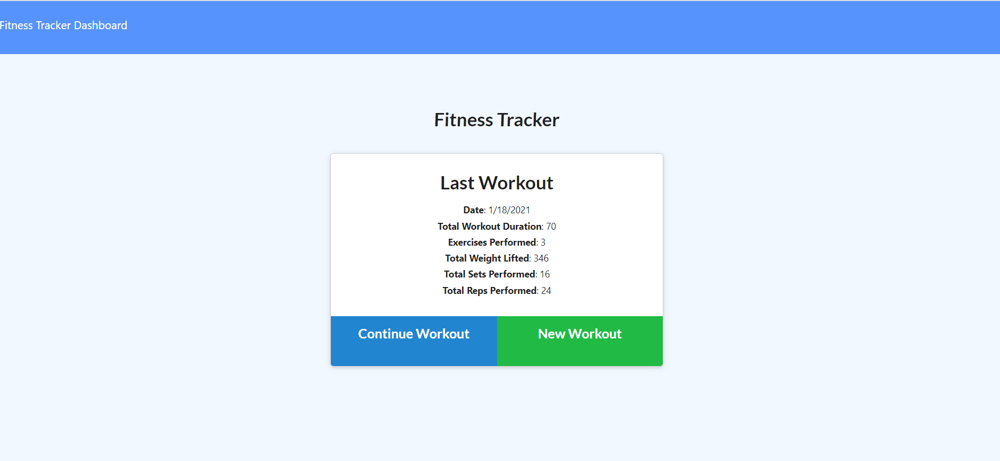
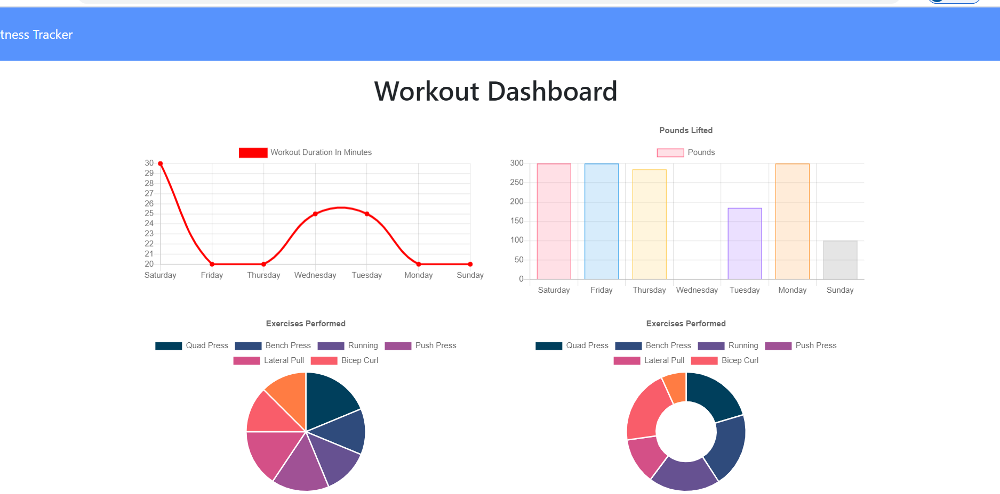

# fitness-tracker-01.16.2021

## About The Project

---

-    When the user open the app , user should be given the option to create a new workout or continue with their last workout.

-    This app allows user to view create and track daily workouts. User able to log multiple exercises in a workout on a given day, allows track the name, type, weight, sets, reps, and duration of exercise. If the exercise is a cardio exercise, user should be able to track distance traveled.

## The user should be able to :

-    Add exercises to the most recent workout plan.

-    Add new exercises to a new workout plan.

-    View the combined weight of multiple exercises from the past seven workouts on the `stats` page.

-    View the total duration of each workout from the past seven workouts on the `stats` page.

## Implemented the following apiRoutes

-    router.get("/api/workouts")
     -    Retrieve all workouts and excercises from database
-    router.post("/api/workouts"),
     -    Create new workout
-    router.put("/api/workouts/:id")
     -    Add excercises to workout
-    router.get("/api/workouts/range")
     -    Range the duration,limit and sort the duration.

## Built With

-    express
-    mongodb
-    mangoose
-    Http verbs get,post and put
-    Mangoose Aggregate functions

## Getting Started

To get a local copy up and running follow below steps.

## Prerequisites

None

## Installation instructions:

Clone the repo git clone git@github.com:NirmalaAbothu/fitness-tracker-01.16.2021.git then open Git Bash window ,navigate to project folder then run
following commands

-    Make a package.json file by running `npm init` from the command line.

-    Run the seed data: `npm run seed`.
-    Open the other GitBash terminal and run : `mongod`
-    Start the server: `node server.js`
-    Navigate to the browser and type: `localhost:3000'
-    Then create workout and add excercises
-    Click on Dashboard(hyper link) at leftside upper corner to see workout dashboard

## Credits

### Followed the below documentation

-    MongoDB documentation on the $addFields
-    MongoDB documentation on the $sum operator
-    Mongoose documentation on aggregate functions

## License & copyright

Copyright © 2020 Nirmala Abothu

[Deployed Heroku Link](https://cryptic-taiga-99986.herokuapp.com/?id=6009fd2f2f573f00150fdaae)
